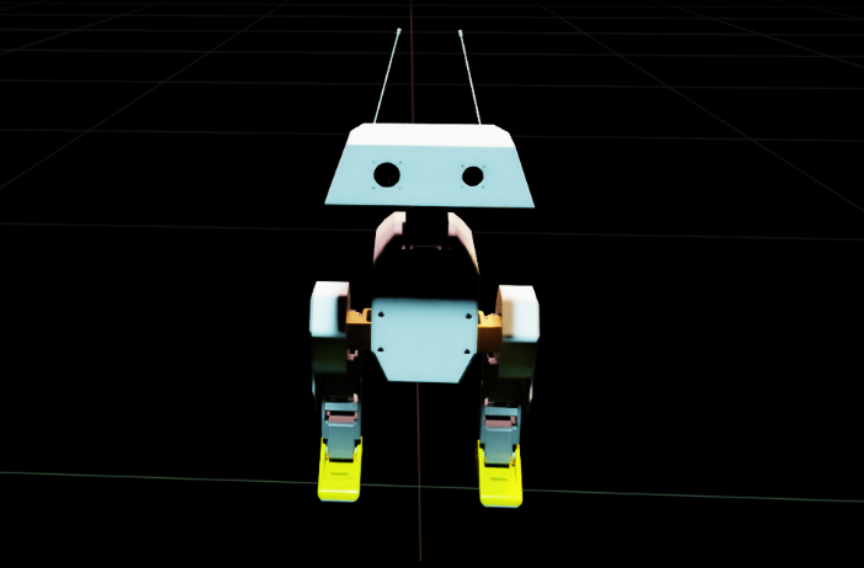
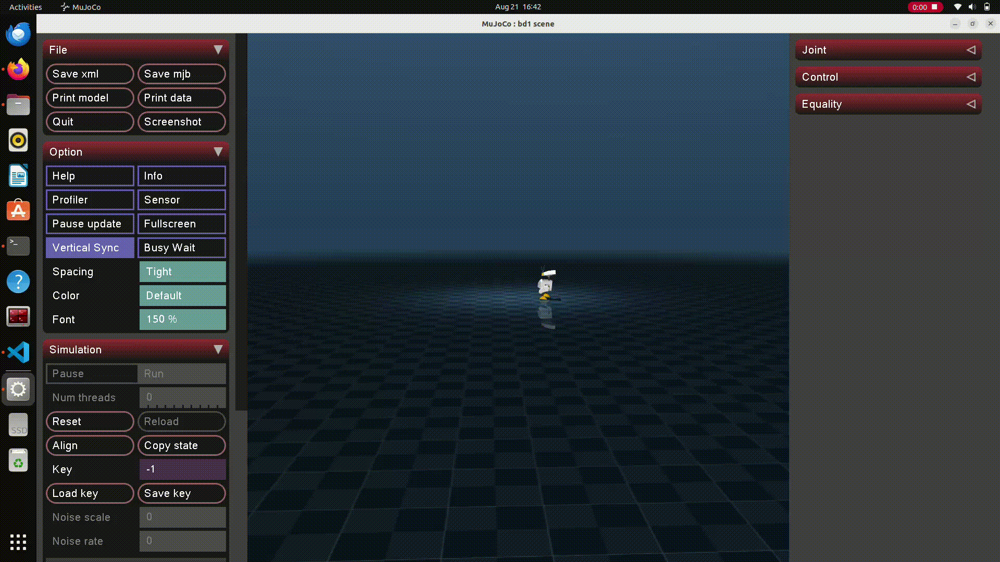
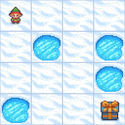
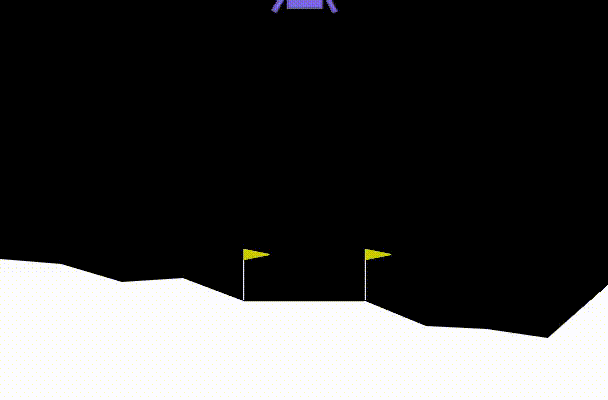
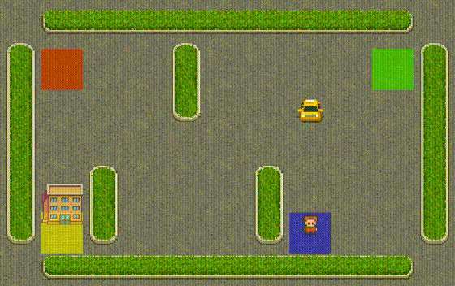

# WADDLE
Waddle involves learning Reinforcement Learning, Deep Learning, Bipedal Locomotion, and Robotic Simulation.

Robots don’t intuitively walk; they’re taught using a policy. Waddle teaches you how to build that policy. You’ll learn to implement reinforcement learning algorithms by solving mini environments. Then you will apply them in MuJoCo and Isaac Lab to train Open Duck, an open-source bipedal robot.  The final stretch benchmarks PPO against SAC on the same robot, adds velocity-command control, and stress-tests the policy with pushes and rough terrain.

# overview 

<p align="center">
  
</p>

Open Duck Mini v2 features 17 Degrees of Freedom (DoF). To achieve stable, autonomous walking, we applied Proximal Policy Optimization (PPO) and Flash Soft Actor-Critic (FlashSAC). The walking gait is implemented using detailed RL reward engineering—combining, weighting, and fine-tuning distinct reward components to ensure proper balance and gait stability.


<p align="center">
  
</p>

<!-- ## ALGORITHM

##  1. Tabular Q-Learning (FrozenLake & Taxi)
* **Q-Table Lookup**: Because the state and action spaces are discrete, Q-values $Q(s, a)$ are stored in a lookup table .

* **Bellman Update Rule**: The agent updates its Q-table iteratively towards the optimal target value using the Bellman optimality equation:

$$Q(s, a) = r(s, a) + \gamma \max_{a} Q(s', a)$$

##  2. Deep Q-Networks: DQN & DDQN (LunarLander)
* **Experience Replay Buffer**: Stores environment transitions $(s, a, r, s', \text{done})$ in a memory buffer. Random mini-batches are sampled during training .
* **Dual-Network Architecture**:
   There is two network one is actor and other is critic . The sample mini batch passed to network then target network chase the critic with changing the weight. during this softmax update are done . $$\theta_{\text{target}} \leftarrow \tau \theta + (1 - \tau) \theta_{\text{target}}$$

## 3. PPO (Proximal policy optimzation)

PPO is a policy optimization algorithm where, instead of choosing the maximum Q-value, we directly optimize the policy. It offers significantly more stability than other algorithms. 
$$L^{\text{CLIP}}(\theta) = \hat{\mathbb{E}}_t \left[ \min\left( r_t(\theta) \hat{A}_t, \, \text{clip}(r_t(\theta), 1-\epsilon, 1+\epsilon) \hat{A}_t \right) \right]$$

$$r_t(\theta) = \frac{\pi_\theta(a_t \mid s_t)}{\pi_{\theta_{\text{old}}}(a_t \mid s_t)}$$
We use a clipping mechanism to bound the changes of the new policy relative to the previous policy. The Advantage is calculated as the Monte Carlo estimation minus the state-value function of the next state.

## 4. FlashSAC

PPO offers stability, but its training requires high sample complexity. Because on-policy algorithms do not reuse historical trajectory data, high variance can occur during training. Therefore, we applied FlashSAC to our Open Duck robot. FlashSAC is built on top of the Soft Actor-Critic (SAC) algorithm.

### 1. Critic Loss

$$J_Q(\theta) = \mathbb{E}_{(s_t, a_t) \sim \mathcal{D}} \left[ \frac{1}{2} \left( Q_\theta(s_t, a_t) - y_t \right)^2 \right]$$

$$y_t = r(s_t, a_t) + \gamma \left( \min_{j=1,2} Q_{\bar{\theta}_j}(s_{t+1}, a_{t+1}) - \alpha \log \pi_\phi(a_{t+1} \mid s_{t+1}) \right)$$

### 2. Actor Loss

$$J_\pi(\phi) = \mathbb{E}_{s_t \sim \mathcal{D}, \, a_t \sim \pi_\phi} \left[ \alpha \log \pi_\phi(a_t \mid s_t) - \min_{j=1,2} Q_{\theta_j}(s_t, a_t) \right]$$

### 3. Temperature (Entropy) Loss

$$J(\alpha) = \mathbb{E}_{a_t \sim \pi_\phi} \left[ -\alpha \left( \log \pi_\phi(a_t \mid s_t) + \mathcal{H}_0 \right) \right]$$

There are four neural networks in this algorithm: two for the actor and two for the critic. When the actor updates based on the critic, any estimation error in the Q-value is inherited by the actor, causing errors to accumulate further over time. To prevent this, we take the minimum of the two action values. Furthermore, instead of solely maximizing the Q-value—which can lead to the over-exploitation of rewards—we encourage exploration by adding an entropy term. -->

---
---

| Frozen Lake | Lunar Lander |
| :---: | :---: |
|  | |
| taxi |
### Taxi-v3

<p align="center">
  
</p>


## 📁 Repository Structure

```text
.
├── FlashSAC/            
├── frozenlake/          
├── halfcheetah_ppo/     
├── humanoid/            
├── lunar landing/ 
├─────── dqn 
├─────── ddqn
├── multi_humanoid/      
├── neural network/      
├── taxi/                
├── walker_2d/      

```

## Getting Started

### Clone the Repository

```bash
git clone https://github.com/palaksinghi/waddle.git
cd waddle
```

### Create a Virtual Environment

```bash
python3.10 -m venv waddle_env
```

### Activate the Virtual Environment

**macOS/Linux:**

```bash
source waddle_env/bin/activate
```

**Windows (PowerShell):**

```bash
.\waddle_env\Scripts\activate
```