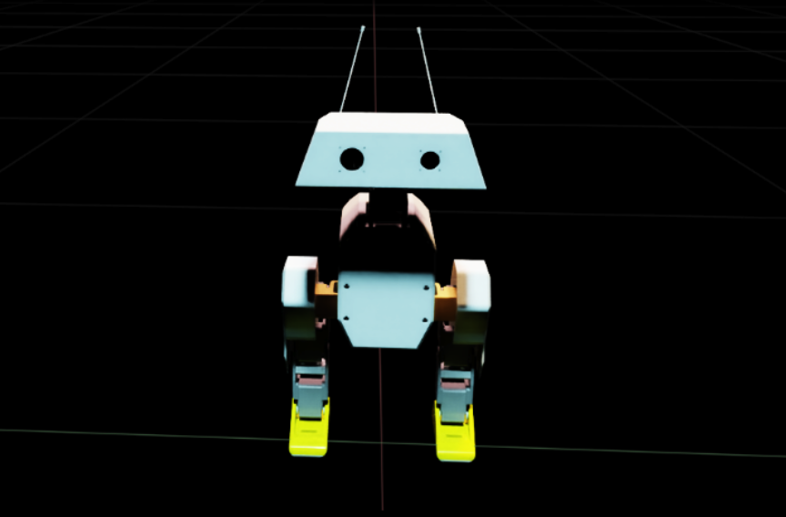
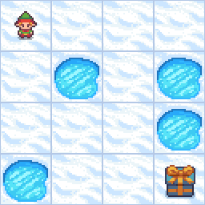
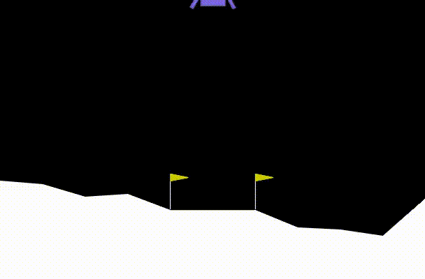
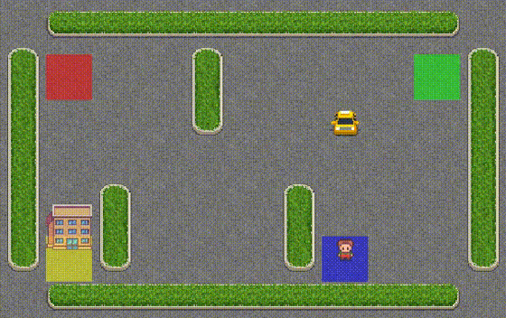
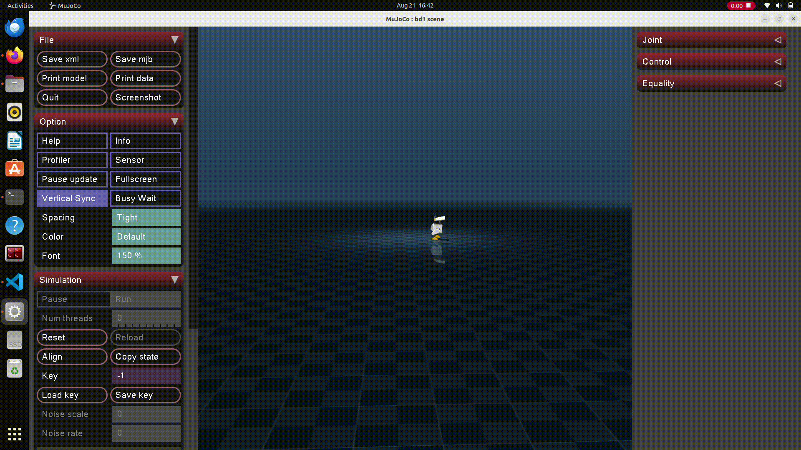
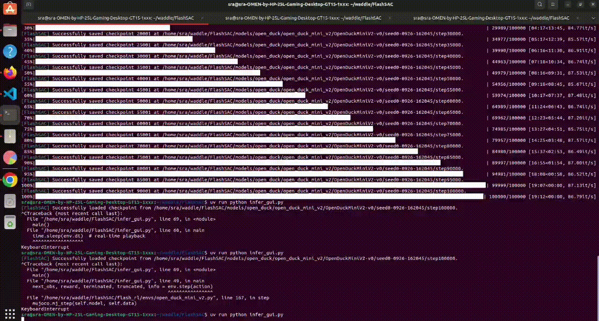

# Waddle
 
**Teaching a tiny robot duck to walk, using reinforcement learning .**
 
Nobody tells a robot exactly how to walk. Instead, it tries things in a simulator, gets rewarded when it stays upright and moves the way we asked, and slowly works out a walking style on its own. The "brain" that decides how every joint should move is called a *policy*, and Waddle is a step-by-step journey to build one.


 The duck's gait comes entirely from reward design: deciding what counts as good walking (stay upright, follow the command, take even steps, don't waste energy) and tuning how much each of those matters. The duck is trained with two algorithms, **PPO** and **FlashSAC** (Flash Soft Actor-Critic) .

<p align="center">

</p>

### Classic control

<table>
  <tr>
    <th align="center">FrozenLake</th>
    <th align="center">LunarLander</th>
    <th align="center">Taxi-v3</th>
  </tr>
  <tr>
    <td align="center"></td>
    <td align="center"></td>
    <td align="center"></td>
  </tr>
</table>


## The robot: Open Duck Mini v2

Open Duck Mini v2 is an open-source bipedal robot with **17 degrees of freedom**. Both simulators load the same robot description, so the policy and reward code can be shared to Mujoco .

| Property | Value |
|----------|-------|
| Degrees of freedom | 17 |
| Simulators | MuJoCo |
| Algorithms | PPO, FlashSAC |


### Observation and action space

```
Observation (dim = 43):
  base angular velocity          3    (wx, wy, wz)
  projected gravity vector       3    (gravity direction in the body frame)
  joint positions                17
  joint velocities               17
  velocity command               3    (vx, vy, wz)
                                 --
                                 43
Action (dim = 17):

```

### Reward engineering
 
The gait is the result of a weighted sum of shaped terms, `r = Σ wᵢ · rᵢ(s, a)`, computed in `compute_reward(e)` and shared by PPO and FlashSAC. The function returns the total reward plus an `info` dict that logs every weighted term as `rew/<name>`, so you can see which terms dominate during training.
 
Design choices worth knowing before you tune anything:
 
- **Tracking rewards.** The duck gets a score between 0 and 1 for matching the speed it was told to walk at. The score is high only when it is very close to the target (roughly within 0.06 m/s) and drops quickly the further away it gets.
- **Walking in a straight line.** Heading and sideways drift are measured against where the duck started (its spawn position and direction), not against the previous step. Small drifts can't add up unnoticed, so the duck can't slowly curve into a circle.
- **Capped penalties.** Some penalties (`yaw_penalty`, `pelvis_vel_tracking`) have a maximum of 5. One bad step can't produce a huge penalty that throws off training.
- **Left and right legs mirror each other.** Walking is two legs taking turns, half a step apart. `symmetry` checks that each leg's pose matches the mirrored pose of the other leg from half a step ago. It looks at the 10 leg joints (5 per leg: yaw, roll, pitch, knee, ankle).
- **No stepping in place when standing still.** `feet_air_time_reward` pays nothing when the commanded speed is almost zero, so the duck isn't rewarded for stepping when it should stand still.
- **Tuned by trial and error.** The weights changed many times along the way. The old values are kept as comments in the reward file.


### Open Duck Mini v2

<table>
  <tr>
    <th align="center">PPO</th>
    <th align="center">FlashSAC</th>
  </tr>
  <tr>
    <td align="center"></td>
    <td align="center"></td>
  </tr>
</table>

## Repo layout

```
waddle/
├── frozenlake/        -- tabular RL on FrozenLake
├── taxi/              -- tabular RL on Taxi-v3
├── lunar landing/
│   ├── dqn/           -- Deep Q-Network on LunarLander
│   └── ddqn/          -- Double DQN on LunarLander
├── neural network/    -- neural network fundamentals used by later stages
├── halfcheetah_ppo/   -- PPO on HalfCheetah (MuJoCo)
├── walker_2d/         -- PPO on Walker2d (MuJoCo)
├── humanoid/          -- PPO on Humanoid (MuJoCo)
├── multi_humanoid/    -- multi-agent humanoid
├── FlashSAC/          -- FlashSAC and PPO training for Open Duck Mini v2
└── gif_collection/    -- trained-policy rollouts shown in Results
```

## Getting started

### Clone

```bash
git clone https://github.com/palaksinghi/waddle.git
cd waddle
```

### Create and activate a virtual environment

```bash
python3.10 -m venv waddle_env
```

```bash
# macOS / Linux
source waddle_env/bin/activate

# Windows (PowerShell)
.\waddle_env\Scripts\activate
```

### Install dependencies

```bash
pip install -r requirements.txt  
```


## Running


```bash
# Tabular RL
cd frozenlake
python train.py   

cd taxi        
python train.py                 

# DQN / Double DQN
python "lunar landing/dqn/train.py"   
python "lunar landing/ddqn/train.py"  


python halfcheetah_ppo/train.py       

# Open Duck Mini v2 

#FlashSAC
cd FlashSAC
uv run python train.py --overrides num_env_steps=100000
uv run python view_policy.py 

#PPO
cd open_duck_bipedal/mujoco
python trainm.py

```
